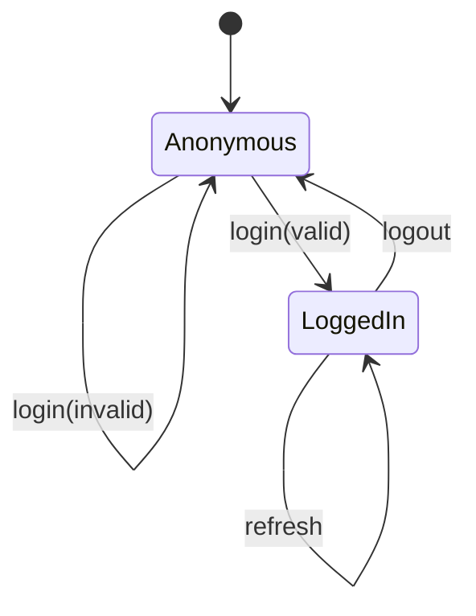

# Test Design Techniques

Stop writing test cases by intuition. This skill walks the agent through the five classical black-box techniques and picks the right one (or combination) for the input — producing a coverage rationale and a deduplicated test-case list ready to feed into `generate-manual-testcase` or `generate-testcase`.

Companion training module: [`training/phase-0-foundations/04-test-design-techniques.md`](../../../training/phase-0-foundations/04-test-design-techniques.md).

---

## When to use this skill

Trigger on:
- "Design test cases for…"
- "What are the boundary values for…"
- "Build a decision table for…"
- "Cover REQ-… with the minimum number of tests"
- "Pairwise this configuration matrix"

**Do NOT use when:**
- The user just wants a single happy-path TC → use `generate-manual-testcase` directly.
- The requirement itself looks vague, untestable, or contradictory — run [`requirement-analysis`](../requirement-analysis/SKILL.md) first to vet it; only design tests against a `READY-FOR-DESIGN` verdict.
- The user's *coding request* (not a requirement) is unclear → use [`ask-questions-if-underspecified`](../ask-questions-if-underspecified/SKILL.md).
- The work is exploratory / unscripted → use exploratory-charter techniques (out of scope).

---

## How to use it

### Step 1 — Pick the technique(s)

| Input shape | Primary technique | Combine with |
|---|---|---|
| One numeric / textual input field with a valid range | **Boundary Value Analysis (BVA)** | EP for non-numeric branches |
| One input with discrete categories (e.g. country, role) | **Equivalence Partitioning (EP)** | BVA on numeric subsets |
| Multiple inputs whose combination changes the outcome (rule-based) | **Decision Table** | EP/BVA per column |
| System has modes/states with transitions (login flow, order state) | **State Transition** | Decision table per transition |
| 3 + configuration parameters (browser × OS × locale × payment method) | **Pairwise (all-pairs)** | EP to bucket each parameter first |
| End-to-end user journey across modules | Use case + decision table | Risk-based prioritisation |

If two techniques apply, run BOTH and merge — duplicates fall out automatically.

### Step 2 — Apply Equivalence Partitioning (EP)

Split the input domain into **disjoint** classes where any one value represents the class:
- **Valid classes** (positive): each yields one TC.
- **Invalid classes** (negative): each yields one TC. Don't combine multiple invalids in one TC — you won't know which one triggered the failure.

Output: a table with `Class | Representative value | Expected outcome`.

### Step 3 — Apply Boundary Value Analysis (BVA)

For every numeric range `[min, max]` (or string-length range `[minLen, maxLen]`) test six points:

```
min - 1   ← invalid lower
min       ← valid boundary
min + 1   ← inside valid
max - 1   ← inside valid
max       ← valid boundary
max + 1   ← invalid upper
```

For inclusive vs exclusive ranges, ask the spec — never guess.

### Step 4 — Build a Decision Table

| # | Cond A | Cond B | Cond C | … | Action / Expected |
|---|---|---|---|---|---|

- Conditions are columns above the rule-rows; actions/outcomes are columns below.
- Collapse duplicate columns when one condition is **don't-care** (`–`) — that's how you reduce 2ⁿ to a manageable set.
- Each remaining rule = one test case.

### Step 5 — State Transition

Draw the state machine first (Mermaid):

Then derive:
- **0-switch** coverage: every transition fires once (minimum).
- **1-switch** coverage: every pair of consecutive transitions fires once (stronger; preferred for auth/checkout).
- Add invalid transitions explicitly — these are the highest-value TCs.

### Step 6 — Pairwise (All-Pairs)

For ≥ 3 parameters, generate the all-pairs covering array. Use [`pict`](https://github.com/microsoft/pict) or PICT-online; never hand-roll for > 4 params.

Document trade-off: pairwise catches ~80% of combinatorial defects with ≤ 20% of the full-factorial test count.

### Step 7 — Output contract

Produce a Markdown table the next skill in the pipeline can consume:

```
| TC ID | Technique | Inputs | Expected | Rationale |
|---|---|---|---|---|
| TC-CART-EP-01 | EP | qty=valid (3) | line total updates | one rep from valid class |
| TC-CART-BVA-01 | BVA | qty=0 (min−1) | error: must be ≥ 1 | lower invalid boundary |
…
```

Every row MUST cite **which class / boundary / rule / state-transition / pair** it covers — that's the rationale column. No rationale, no test case.

---

## Decision tree

```
Requirement ?
├── 1 input, numeric/string range → BVA + EP
├── 1 input, discrete categories  → EP
├── n inputs, rule-driven         → Decision Table (+ EP per cell)
├── modes / states / transitions  → State Transition (1-switch)
├── 3 + config parameters         → Pairwise (after EP per parameter)
└── End-to-end journey            → Use case + decision table + risk score
```

---

## Best practices

- **One invalid per TC.** Stacking invalids hides which one fires.
- **Document the why.** The rationale column protects against test removal during refactors.
- **Bound your boundaries.** Always include `min−1`, `max+1` even when the spec is silent — that's where bugs hide.
- **Prioritise.** After deriving the full list, tag each TC with `@P1/@P2/@P3` per `prompts/core/test-tags.md` so CI shards correctly.
- **Hand off, don't author.** This skill produces TC outlines; let `generate-manual-testcase` (manual) or `generate-testcase` (automated) write the actual case files.
- **Re-derive on requirement change.** Don't patch the table — regenerate it from the new spec.

---

## Related

- [`prompts/core/manual-test-case-generator.md`](../../../prompts/core/manual-test-case-generator.md) — turns the TC outline into manual cases.
- [`prompts/core/test-generator.md`](../../../prompts/core/test-generator.md) — turns the outline into Playwright specs.
- [`training/phase-0-foundations/04-test-design-techniques.md`](../../../training/phase-0-foundations/04-test-design-techniques.md) — full theory + worked examples.
- [`prompts/core/test-tags.md`](../../../prompts/core/test-tags.md) — priority/severity tagging applied after design.
