# 64 Essential QA Testing Metrics — Visualized Report

> **Source:** [Tricentis — *64 Essential Testing Metrics for Measuring Quality Assurance Success*](https://www.tricentis.com/blog/64-essential-testing-metrics-for-measuring-quality-assurance-success) (Swati Seela & Ryan Yackel, 2016).
>
> **Purpose of this file:** turn the article's prose into a **visual, formula-driven, dashboard-ready reference** that QA managers, test leads, and automation engineers in this repo can copy directly into status decks, sprint dashboards, and the [QA Metrics Dashboard](../../templates/qa-metrics-dashboard.html).
>
> Every metric below carries: **definition · formula · visualization · worked example · "so what" interpretation**.

---

## Tool guides in this folder

| File | What it covers | When to read |
|---|---|---|
| [`report-portal.md`](./report-portal.md) | ReportPortal v26.0.2 + `@reportportal/agent-js-playwright` v5.4.0 — server provisioning, Playwright reporter wiring, CI integration, comparison vs `list` / `html` / `junit` / `allure` | Adding the multi-run, cross-team trend dashboard alongside the in-repo `qa-metrics-dashboard.html` |

---

## How to read this report

```
ABSOLUTE NUMBERS  ──►  DERIVATIVE METRICS  ──►  TREND CHARTS  ──►  DECISIONS
   (raw counts)        (ratios, rates, %)       (over time)      (ship / hold)
   metrics 1-12        metrics 13-44            metrics 45-61    metrics 62-64
```

Two kinds of metrics:

| Kind | Definition | Example |
|---|---|---|
| **Result metric** | Absolute measure of a completed activity | Time taken to run a test suite |
| **Predictive metric** | Derivative that flags an unfavourable result early | Defects-created-vs-resolved slope |

The 10 questions every QA report must answer (Tricentis):

1. How long will it take to test?
2. How much money will it take to test?
3. How bad are the bugs?
4. How many bugs found were fixed / reopened / closed / deferred?
5. How many bugs did the test team **not** find?
6. How much of the software was tested?
7. Will testing be done on time? Can the software be shipped on time?
8. How good were the tests? Are we using low-value test cases?
9. What is the cost of testing?
10. Was the test effort adequate?

---

## Table of contents

| § | Category | Metrics | What it answers |
|---|---|---|---|
| [1](#1-fundamental-absolute-numbers-1-12) | Fundamental absolute numbers | 1–12 | Raw counts — the building blocks |
| [2](#2-test-tracking--efficiency-13-21) | Test tracking & efficiency | 13–21 | Are we executing on schedule? |
| [3](#3-test-effort-22-27) | Test effort | 22–27 | How long, how many, how much? |
| [4](#4-test-effectiveness-28-29) | Test effectiveness | 28–29 | How good were the tests? |
| [5](#5-test-coverage-30-34) | Test coverage | 30–34 | How much of the app was tested? |
| [6](#6-test-economics-35-40) | Test economics | 35–40 | What did testing cost? |
| [7](#7-test-team-metrics-41-44) | Test team metrics | 41–44 | Is workload balanced? |
| [8](#8-test-execution-status-45) | Test execution status | 45 | Snapshot of run state today |
| [9](#9-execution--defect-find-rate-46) | Execution & defect find rate | 46 | Are we trending toward done? |
| [10](#10-effectiveness-of-change-47-48) | Effectiveness of change | 47–48 | Are recent changes risky? |
| [11](#11-defect-distribution-49-56) | Defect distribution (snapshot) | 49–56 | Where are the bugs concentrated? |
| [12](#12-defect-distribution-over-time-57-60) | Defect distribution over time | 57–60 | Are we getting better or worse? |
| [13](#13-defects-created-vs-resolved-61) | Defects created vs resolved | 61 | Are we ready to ship? |
| [14](#14-more-defect-metrics-62-64) | More defect metrics | 62–64 | Removal efficiency, density, age |

---

## 1. Fundamental absolute numbers (1–12)

Raw counts that feed every derived metric. Track them in a single source of truth (TestRail / qTest / Xray / Jira) — never in spreadsheets.

| # | Metric | Symbol | Where it goes |
|---|---|---|---|
| 1 | Total number of test cases | `TC_total` | Coverage % denominator |
| 2 | Test cases passed | `TC_pass` | Pass-rate numerator |
| 3 | Test cases failed | `TC_fail` | Fail-rate, defect ratio |
| 4 | Test cases blocked | `TC_block` | Environment / dependency risk |
| 5 | Defects found | `D_found` | Test effectiveness, density |
| 6 | Defects accepted | `D_acc` | Removal efficiency numerator |
| 7 | Defects rejected | `D_rej` | Test-set noise, signal strength |
| 8 | Defects deferred | `D_def` | Tech-debt backlog growth |
| 9 | Critical defects | `D_crit` | Release-blocker count |
| 10 | Planned test hours | `H_plan` | Schedule variance baseline |
| 11 | Actual test hours | `H_act` | Schedule variance actual |
| 12 | Bugs found after shipping | `D_escape` | Test effectiveness denominator |

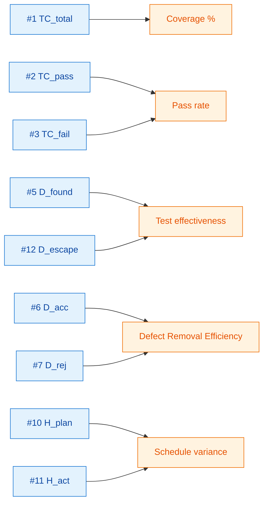

---

## 2. Test tracking & efficiency (13–21)

Metrics that show **velocity** — how quickly cases are executed and how cleanly they pass.

| # | Metric | Formula | Healthy band |
|---|---|---|---|
| 13 | **Pass rate** | `TC_pass / TC_executed × 100` | ≥ 90% by code-freeze |
| 14 | **Fail rate** | `TC_fail / TC_executed × 100` | ≤ 5% trending down |
| 15 | **Block rate** | `TC_block / TC_total × 100` | ≤ 2% (anything else = env. issue) |
| 16 | **Test execution rate** | `TC_executed / TC_planned × 100` | ≥ 100% by exit gate |
| 17 | **Defect ratio (defects / TC executed)** | `D_found / TC_executed` | Project-specific baseline |
| 18 | **Defects per test cycle** | `Σ D_found in cycle` | Should drop cycle-over-cycle |
| 19 | **Re-test rate** | `TC_retested / TC_total × 100` | ≤ 15% (else regression scope grew) |
| 20 | **Pass rate trend** | Δ pass-rate per cycle | Slope ≥ 0 across last 3 cycles |
| 21 | **First-time pass rate** | `TC_pass_on_first_run / TC_executed × 100` | ≥ 80% (else flaky / unstable) |

### Visualization — daily progress

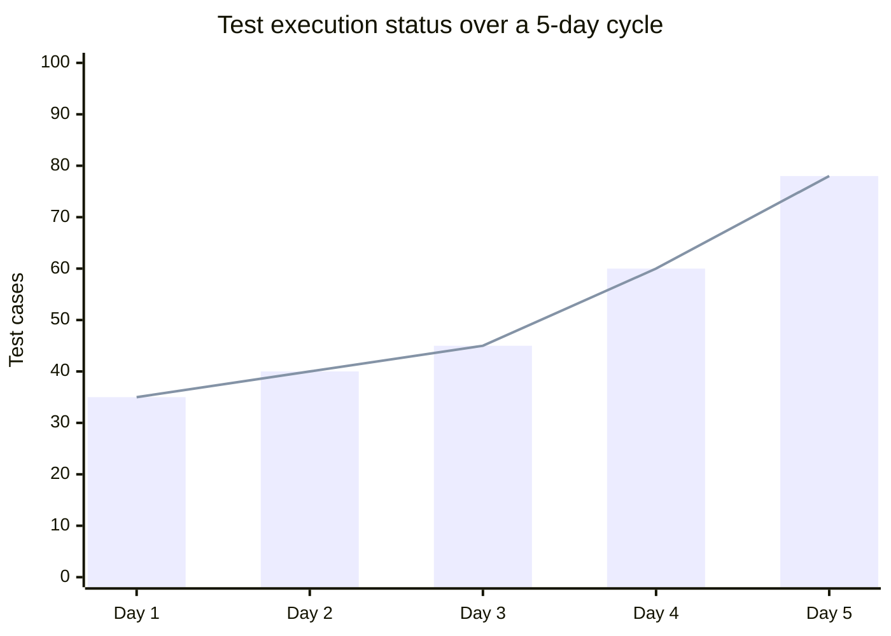

### Worked example

```
TC_total       = 200
TC_executed    = 180
TC_pass        = 162
TC_fail        =  12
TC_block       =   6

Pass rate              = 162 / 180 × 100 = 90.0 %  ✅
Fail rate              =  12 / 180 × 100 =  6.7 %  🟡
Block rate             =   6 / 200 × 100 =  3.0 %  🟡 (chase env. owners)
Test execution rate    = 180 / 200 × 100 = 90.0 %  🟡 (need to clear the last 20)
```

---

## 3. Test effort (22–27)

> Effort metrics answer **"how long, how many, how much?"** — they establish baselines for future planning. Remember: **half the values fall above the average and half below**, so always pair averages with **percentiles** or **range**.

| # | Metric | Formula | Use it for |
|---|---|---|---|
| 22 | **Avg. time to design a test case** | `Σ design_minutes / TC_designed` | Estimating new feature coverage |
| 23 | **Avg. time to execute a test case** | `Σ exec_minutes / TC_executed` | Cycle-time forecasting |
| 24 | **Avg. time to fix a defect** | `Σ fix_hours / D_resolved` | Capacity planning, SLA setting |
| 25 | **Avg. time to retest a defect** | `Σ retest_minutes / D_retested` | Verification capacity |
| 26 | **Tester productivity** | `TC_executed / tester_day` | Utilisation, fairness |
| 27 | **Test cycle duration** | `cycle_end − cycle_start` | Release cadence baseline |

### Visualization — effort distribution

```
  Time-to-execute (minutes per TC)
  P50 ┤█████████████ 12
  P75 ┤█████████████████ 17
  P90 ┤█████████████████████████ 25
  P99 ┤████████████████████████████████████████ 41
       └─────────────────────────────────────────►
        Always report P50 + P90, never just the mean.
```

---

## 4. Test effectiveness (28–29)

> *"How good were the tests?"* Measures the bug-finding ability of the test set.

### Metric 28 — Defect Containment Efficiency (DCE)

```
                       D_found_in_test
DCE  =  ───────────────────────────────────────────  × 100
         D_found_in_test  +  D_escaped_to_prod
```

| Score | Interpretation | Action |
|---|---|---|
| ≥ 95% | Excellent — test set catches almost everything | Maintain & optimise |
| 85–94% | Good — typical mature suite | Investigate top escape patterns |
| 70–84% | Average — meaningful escape rate | Add cases for top escape modules |
| < 70% | Weak — major escapes | Review test design, add EP/BVA + risk-based cases |

#### Worked example
```
Release R12:
  D_found_in_test   =  80
  D_escaped_to_prod =  20
  DCE               =  80 / 100 × 100  =  80 %
  → 20 % of defects got away from QA. Trigger root-cause review of the 20 escapes.
```

### Metric 29 — Context-based effectiveness (team rating)

When DCE is unreliable (mature product / very buggy product / time-boxed), poll the team:

> *"On a 1–10 scale, how complete, up-to-date, and effective is our test set today?"*

```
Team rating histogram (n = 8)
 10 ┤█           1 vote
  9 ┤██          2 votes
  8 ┤███         3 votes
  7 ┤██          2 votes
       Average = 8.25  →  good, but ask the 7-voters why.
```

---

## 5. Test coverage (30–34)

> *"How much of the application was tested?"* — none of these can ever truly hit 100 %. **Define what 100 % means for your bounded inventory** (e.g., all P1+P2 requirements have ≥ 1 passing automated test).

| # | Metric | Formula | Visualisation |
|---|---|---|---|
| 30 | **Test execution coverage** | `TC_executed / TC_total × 100` | Donut / progress bar |
| 31 | **Requirements coverage** | `REQ_with_test / REQ_total × 100` | Stacked bar (Pass / Fail / Untested) |
| 32 | **Test cases per requirement** | Pivot REQ → TCs → result | Traceability matrix |
| 33 | **Defects per requirement (Requirement Defect Density)** | `D_in_REQ / REQ_count` | Bar chart, sort desc |
| 34 | **Requirements without test coverage** | `REQ_uncovered` filtered by status | Risk-coloured table |

### Metric 32 — Traceability matrix (template)

| REQ ID | TC name | Test result | Last run |
|---|---|---|---|
| REQ-101 | TC-Login-OK | ✅ Pass | 2025-12-04 |
| REQ-102 | TC-Login-Locked | ❌ Fail | 2025-12-04 |
| REQ-103 | TC-Reset-Pwd | ⏳ Incomplete | — |

> Wired to the [requirements-traceability skill](../../.agents/skills/requirements-traceability/SKILL.md).

### Metric 33 — Requirement Defect Density

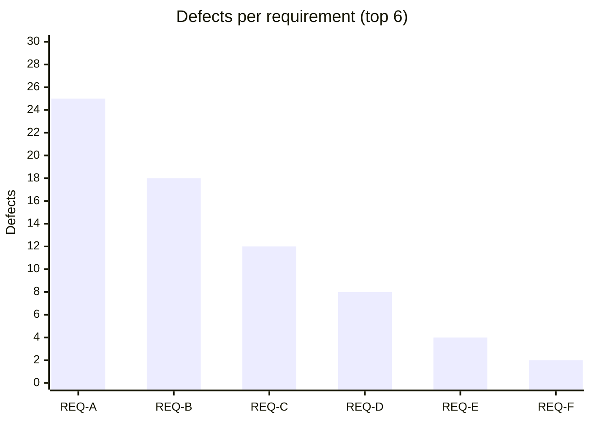

> REQ-A has 25 defects → the **requirement** (not the test) is likely the problem. Send it back to product.

### Metric 34 — Uncovered requirements (risk-coloured)

| REQ ID | Name | Status | Risk |
|---|---|---|---|
| REQ-201 | Payment retry | **Done** | 🔴 HIGH — shipped without tests |
| REQ-202 | CSV export | In Progress | 🟡 MED — add tests before "Done" |
| REQ-203 | Dark-mode toggle | To Do | 🟢 LOW — write tests with story |

---

## 6. Test economics (35–40)

> People (time), infrastructure, and tools all cost money. Track every line so you can defend your budget at the next QBR.

| # | Metric | Formula |
|---|---|---|
| 35 | **Total allocated cost for testing** | Sum of approved budget |
| 36 | **Actual cost of testing** | `Σ hours × $/hr  +  tooling  +  infra` |
| 37 | **Budget variance** | `Actual − Planned` (≈ 0 is best) |
| 38 | **Schedule variance** | `H_act − H_plan` |
| 39 | **Cost per bug fix** | `dev_hours_on_bug × $/hr` (+ retest cost optionally) |
| 40 | **Cost of NOT testing** | Subjective — see below |

### Metric 40 — Cost of NOT testing (qualitative)

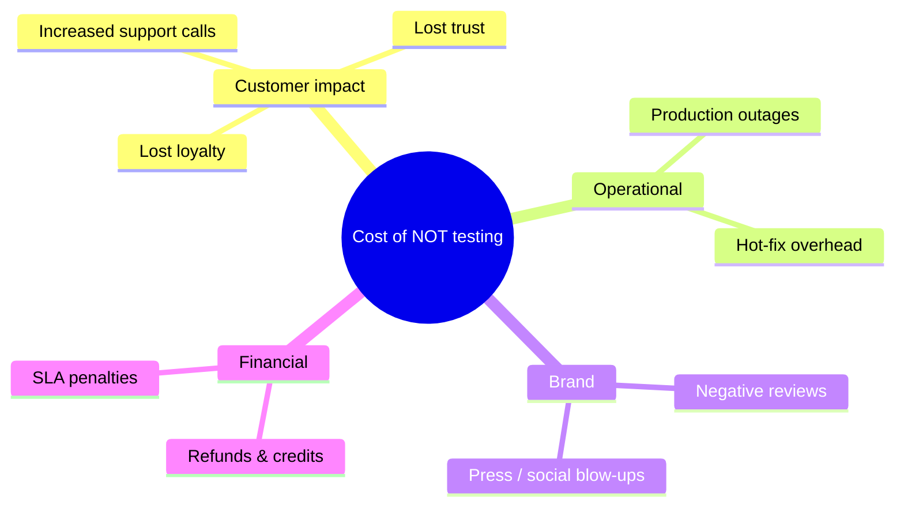

### Worked example — metric 39

```
Bug ID: PAY-1407
  Dev hours to fix      : 10
  Dev hourly rate       : $60
  Retest hours (QA)     : 1.5
  QA hourly rate        : $45

Cost per bug fix        = (10 × 60) + (1.5 × 45)
                        = $600 + $67.50
                        = $667.50
```

---

## 7. Test team metrics (41–44)

> ⚠️ **Use as a learning tool, never as a blame tool.** Surface imbalance early so the lead can re-distribute.

| # | Metric | Visualisation |
|---|---|---|
| 41 | Distribution of defects returned per team member | Pie / bar |
| 42 | Distribution of open defects for retest per tester | Stacked bar |
| 43 | Test cases allocated per tester | Bar |
| 44 | Test cases executed per tester | Bar |

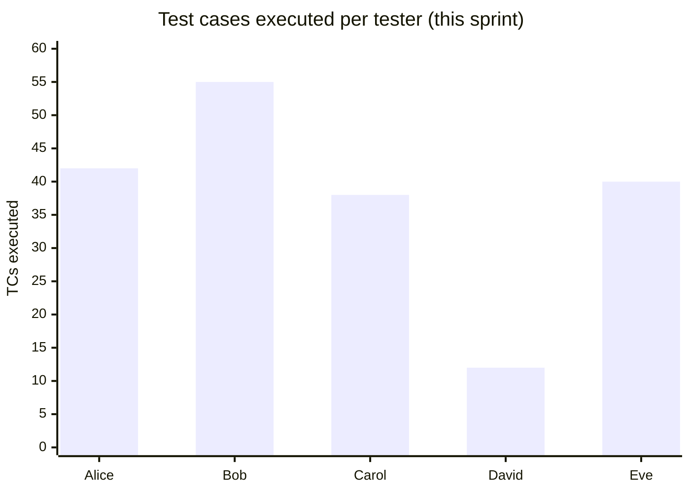

> Bob is overbooked, David is underutilised. Lead's job: rebalance, not rank.

---

## 8. Test execution status (45)

> Snapshot of total executions organised as **Passed / Failed / Blocked / Incomplete / Unexecuted** — the single best chart for daily stand-ups because growing/shrinking bars stick in people's minds far better than raw numbers.

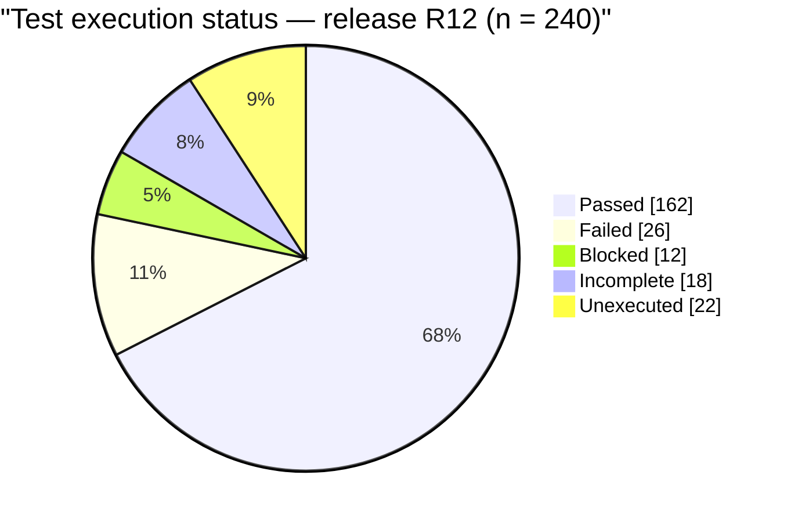

### Stand-up version (compact)

```
R12 — Day 4 of 7
 Passed     ████████████████████████████████████ 162  68%
 Failed     ███████                               26  11%
 Blocked    ███                                   12   5%
 Incomplete █████                                 18   8%
 Pending    ██████                                22   9%
                                                ───
                                                 240
```

---

## 9. Execution & defect find rate (46)

> Plot **theoretical (planned)** curves against **actual** curves for both **test execution** and **defect find rate**. Divergence is your earliest red flag that you'll miss the date.

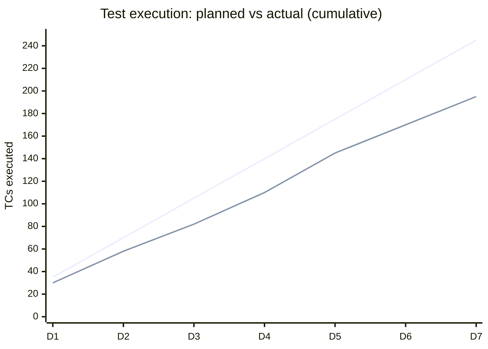

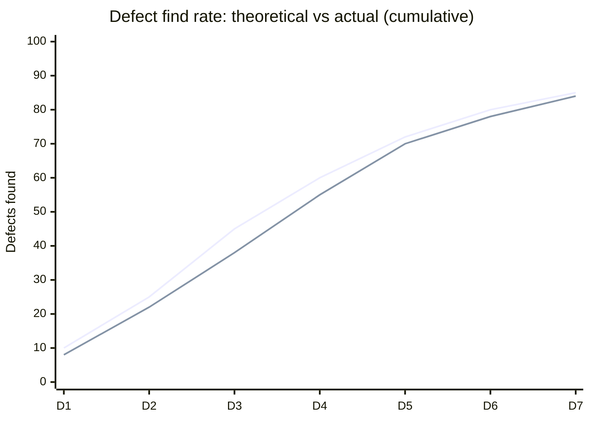

> If the **actual** line for execution slips below planned **and** defect-find rate is still climbing → testing is behind **and** the product is not stabilising. Replan.

---

## 10. Effectiveness of change (47–48)

| # | Metric | Formula |
|---|---|---|
| 47 | **Effect of testing changes** | Count of defects attributed to a specific change set |
| 48 | **Defect injection rate** | `D_attributable_to_change / N_changes` |

### Worked example — metric 48

```
N_changes                       = 10
D_attributable_to_those_changes = 30

Defect injection rate           = 30 / 10  =  3 defects per change

Forecast: the next 5-change PR is expected to inject ≈ 15 defects.
Plan QA capacity accordingly.
```

---

## 11. Defect distribution (snapshot) (49–56)

> Pie / histogram / Pareto charts that show **where** defects are concentrated **right now**.

| # | Distribute by | Use to find |
|---|---|---|
| 49 | Cause | Root-cause clusters |
| 50 | Module / functional area | Hot modules |
| 51 | Severity | Release-blockers |
| 52 | Priority | Fix-order |
| 53 | Type | Process gaps (UI vs logic vs perf) |
| 54 | Tester (Dev / QA / UAT / End-user) | Where escapes originate |
| 55 | Test type (review, walkthrough, exec, exploration) | Most-effective activity |
| 56 | Platform / Environment | OS / browser hot-spots |

### Metric 49 — Defect distribution by cause

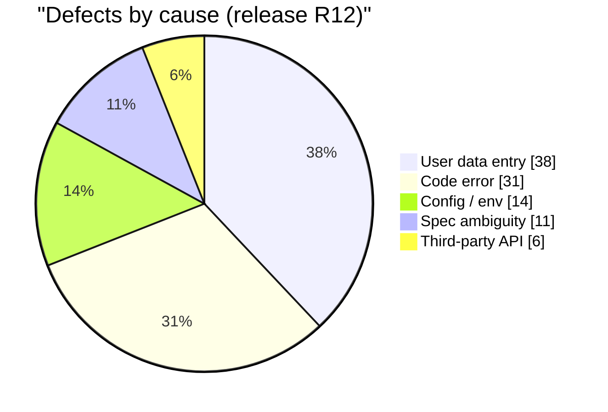

### Metric 51 — Defect distribution by severity (stacked with cause)

```
Cause               Critical  Major  Minor  Trivial   Total
─────────────────── ────────  ─────  ─────  ───────  ──────
User data entry         2       8     22       6        38
Code error             10      14      6       1        31  ← focus here
Config / env            1       4      7       2        14
Spec ambiguity          0       3      6       2        11
Third-party API         3       2      1       0         6
─────────────────── ────────  ─────  ─────  ───────  ──────
Total                  16      31     42      11       100
```

> "User data entry" has the most defects, but most are minor. **"Code error" has the highest count of *severe* defects** → fix that first.

### Metric 51 — Pareto (the 80 / 20)

```
Cumulative % of defects
100 ┤                                  ●─────●
 90 ┤                          ●───────
 80 ┤ ─ ─ ─ ─ ─ ─ ─ ─ ─ ─ ●─ ─ ─ ─ ─ ─ ─ ─ ─ ─ ← 80% line
 70 ┤                ●
 60 ┤        ●
 40 ┤   ●
    └─────────────────────────────────────────►
       UDE   Code  Config Spec   3rd-API
       ↑     ↑
       └ 80% of defects come from these 2 causes → fix them first.
```

---

## 12. Defect distribution over time (57–60)

> Snapshots are static; **trends** tell you whether you're winning or losing.

| # | Trend by | Catches |
|---|---|---|
| 57 | Cause | Process improvements actually landing |
| 58 | Module | Module that won't stabilise |
| 59 | Severity | Critical-bug arrival rate creeping up |
| 60 | Platform | Browser/OS/tier regression |

### Metric 57 — Defects by cause over 5 cycles

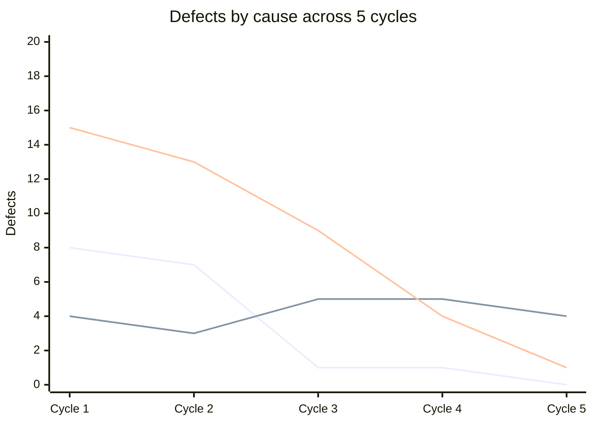

> - **Code errors** fell sharply after Cycle 2 → dev fix-rate working.
> - **User data-entry errors** dropped → users adapting / UI improved.
> - **Security defects stayed flat** → no improvement, escalate.

---

## 13. Defects created vs resolved (61)

> The **single most important** chart in any QA dashboard. Plots **cumulative** found vs **cumulative** resolved over a cycle.

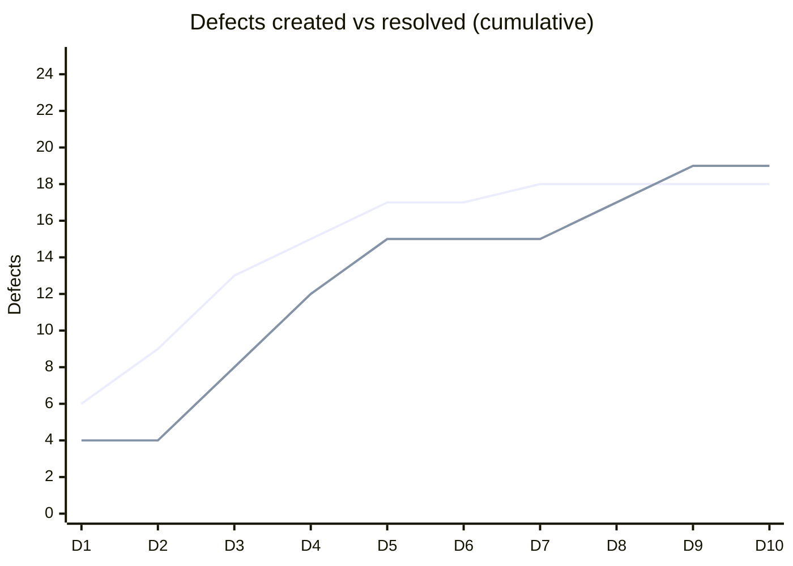

### How to read it

| Pattern | Meaning | Decision |
|---|---|---|
| **Found-line flattens** at end of cycle | Bug-find rate has dropped | Likely safe to ship |
| **Found & resolved lines converge** | Defect process is keeping up | Healthy — keep going |
| Found line keeps **steepening** | Still finding new bugs | Do **not** ship — extend cycle |
| Resolved line **flat / far below found** | Dev is not keeping up | Escalate, reduce inflow |

### Worked data (Tricentis original)

| Date | Created | Resolved | Cum. Created | Cum. Resolved |
|---|---:|---:|---:|---:|
| 10/10 | 6 | 4 | 6 | 4 |
| 10/11 | 3 | 0 | 9 | 4 |
| 10/12 | 4 | 4 | 13 | 8 |
| 10/13 | 2 | 4 | 15 | 12 |
| 10/14 | 2 | 3 | 17 | 15 |
| 10/15 | 0 | 0 | 17 | 15 |
| 10/16 | 1 | 0 | 18 | 15 |
| 10/17 | 0 | 2 | 18 | 17 |
| 10/18 | 0 | 2 | 18 | 19 |
| 10/19 | 0 | 0 | 18 | 19 |

> Found-line flattens (15→18 over 4 days), resolved-line catches up (15→19) → **ship signal is green.**

---

## 14. More defect metrics (62–64)

### Metric 62 — Defect Removal Efficiency / Defect Gap

```
                            D_resolved
DRE  =  ──────────────────────────────────────────────────  × 100
         D_submitted  −  D_invalid (rejected, duplicates)
```

#### Worked example
```
D_submitted = 100
D_invalid   =  20  (rejected + duplicates)
D_resolved  =  65

DRE  =  65 / (100 − 20) × 100
     =  65 / 80 × 100
     ≈  81 %        🟢 healthy ( ≥ 80 % typical target )
```

#### DRE trend over releases

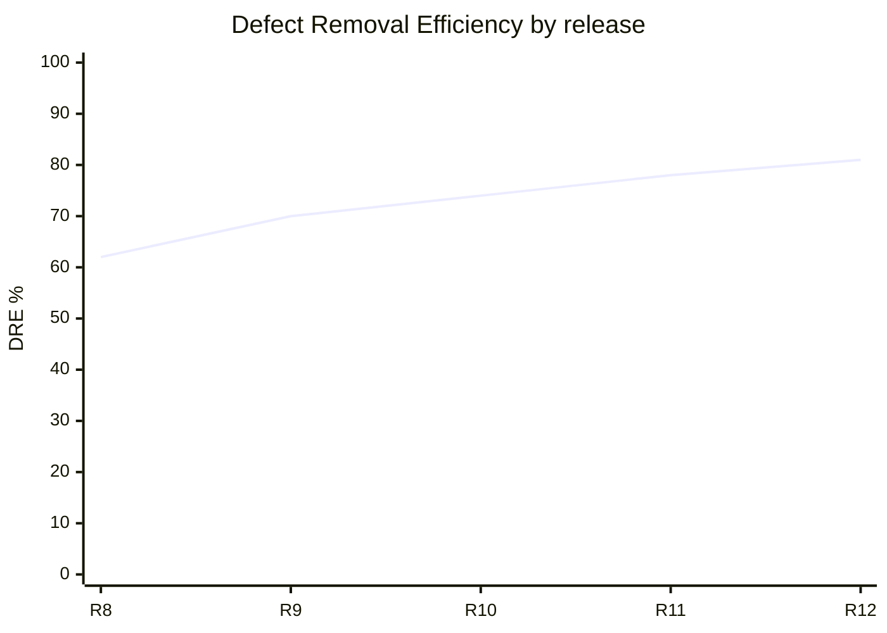

> Steady rise → dev / QA cadence is improving. A sudden drop is your early-warning klaxon.

---

### Metric 63 — Defect Density

```
                  Total defects in artefact
Defect density = ──────────────────────────
                  Size of artefact
```

`Size` may be **modules**, **KLOC**, **function points**, or **screens** — pick one and stay consistent.

#### Worked example
```
Total defects = 30
Modules       =  6
Defect density = 30 / 6 = 5 defects per module
```

#### Visualization — module heatmap

```
Module          Defects   Density (per kLOC)
────────────── ─────────  ───────────────────
checkout           14         9.3   🔴
search              9         3.1   🟡
auth                3         1.2   🟢
profile             2         0.9   🟢
admin               2         0.6   🟢
─────────────────────────────────────────────
Total              30
```

---

### Metric 64 — Defect Age

```
Defect age = time_resolved − time_created
```

Unit: **days** for traditional cycles, **hours** for daily / weekly release teams.

#### Visualisation — age histogram by severity

```
Defect age (days), critical defects only — last 30 days
 0–1 day  ████████ 8
 2–3 days ████ 4
 4–7 days ██ 2
 > 7 days █ 1
                 ─────
                 Total 15  →  P50 = 1 d, P90 = 5 d  ✅ healthy SLA
```

#### Worked example
```
Bug LOG-901
  Created  : 2025-12-01 09:00
  Resolved : 2025-12-04 16:00

Defect age = 3 days 7 hours  ≈  3.3 days
```

> Track **mean** *and* **P90** defect age per severity. Means hide outliers; P90 catches them.

---

## Putting it together — a 1-screen dashboard

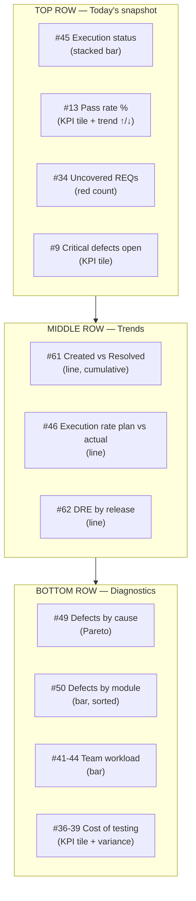

> The repo's existing [`templates/qa-metrics-dashboard.html`](../../templates/qa-metrics-dashboard.html) implements this layout — wire each tile to the metric numbers above so reviewers can audit the math.

---

## Cross-references in this repo

| If you want to… | Use… |
|---|---|
| Compute & email a single composite quality number | [quality-score skill](../../.agents/skills/quality-score/SKILL.md) |
| Build the trend rollup that powers metric #20, #62 | [trend-analysis skill](../../.agents/skills/trend-analysis/SKILL.md) |
| Mine open defects for metrics #49–60 patterns | [defect-insights skill](../../.agents/skills/defect-insights/SKILL.md) |
| Map metric #31 (Requirements coverage) | [requirements-traceability skill](../../.agents/skills/requirements-traceability/SKILL.md) |
| Compose a leadership-ready summary citing these metrics | [executive-summary skill](../../.agents/skills/executive-summary/SKILL.md) |
| Justify the budget side (metrics #35–40) | [`documents/roi/calculator.md`](../roi/calculator.md) |

---

## Glossary

| Term | Definition |
|---|---|
| **DCE** | Defect Containment Efficiency (metric 28) — % of defects caught before prod |
| **DRE** | Defect Removal Efficiency (metric 62) — % of valid defects fixed in cycle |
| **Defect injection rate** | Defects introduced per change (metric 48) |
| **Pareto** | Sorted bar + cumulative-% line — the "80/20" view |
| **P50 / P90** | Percentile — half / 90% of values fall below this |
| **Cycle** | One end-to-end test pass through the suite |
| **Escape** | Defect found in production after release (metric 12) |

---

## References

- Swati Seela & Ryan Yackel — *64 Essential Testing Metrics for Measuring Quality Assurance Success*, Tricentis blog, 2016 — [tricentis.com/blog/64-essential-testing-metrics…](https://www.tricentis.com/blog/64-essential-testing-metrics-for-measuring-quality-assurance-success)
- Rex Black — *Managing the Testing Process*, Ch. 4 *"How Defect Removal Proceeds"* — basis for metric 61
- Repo dashboard: [`templates/qa-metrics-dashboard.html`](../../templates/qa-metrics-dashboard.html)
- ROI mapping: [`documents/roi/calculator.md`](../roi/calculator.md)
