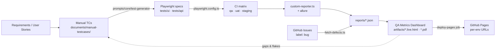

# Welcome to the ai-qa-training wiki

> **A production-grade QA automation playground that doubles as a training curriculum.**
> Real Playwright + TypeScript suite against an OpenCart e-commerce demo, a strict POM framework, a live multi-env QA Metrics dashboard, and a tightly-coupled library of AI prompts & Agent Skills — all wired together so a learner can read, run, extend, and ship tests on day one.

| | |
|---|---|
| **Website Under Test** | <https://ecommerce-playground.lambdatest.io/> |
| **Live QA Dashboard** | <https://khanhdodang.github.io/ai-qa-training/> *(QA env, auto-deployed from `main`)* |
| **Source** | <https://github.com/khanhdodang/ai-qa-training> |
| **Stack** | Playwright · TypeScript (strict) · Allure 3 · Chart.js · GitHub Actions |

---

## What this repo gives you

Five things, working together — not five separate folders:

1. **A real test suite.** ~46 manual test cases mapped 1:1 to Playwright specs (UI · API · hybrid), runnable against **qa / uat / staging** environments out of the box.
2. **A strict framework.** Three-layer POM (`locators/` → `pages/` → `tests/`), `commonPage` discipline for actions, `assertHelper` + `Assertions` for verifications, web-first assertions, deterministic waits, test-tag guardrails.
3. **A live QA cockpit.** A self-contained dashboard rendering execution metrics (`run-summary.json`), defects pulled from GitHub Issues (`defects.json`), and requirements ↔ TC ↔ spec traceability — auto-deployed per environment on every push to `main`.
4. **An AI prompt + skill library.** ~25 curated prompts (`prompts/core` · `advanced` · `devops` · `reporting`) and 30+ Agent Skills (`.agents/skills/`) that already know this repo's conventions, so AI-generated code lands compliant on the first try.
5. **A 33-module training curriculum.** Six phases (Foundations → Toolkit → Playwright Core → Framework → API & Quality → Quality at Scale → AI-Assisted QA) under [`training/`](https://github.com/khanhdodang/ai-qa-training/tree/main/training), each module backed by code in this repo.

---

## How it all flows



The right-to-left feedback loop is the point: dashboards surface gaps and flakes, which open issues, which drive new TCs, which generate new specs.

---

## Live reports (auto-deployed from `main`)

Every push to `main` runs the test matrix and publishes a per-env dashboard via [`.github/workflows/playwright.yml`](https://github.com/khanhdodang/ai-qa-training/blob/main/.github/workflows/playwright.yml):

| Environment | Dashboard | Allure | Playwright |
|---|---|---|---|
| 🟢 **QA** *(canonical / site root)* | <https://khanhdodang.github.io/ai-qa-training/qa/> | [allure](https://khanhdodang.github.io/ai-qa-training/qa/allure/) | [playwright](https://khanhdodang.github.io/ai-qa-training/qa/playwright/) |
| 🟡 **UAT** | <https://khanhdodang.github.io/ai-qa-training/uat/> | [allure](https://khanhdodang.github.io/ai-qa-training/uat/allure/) | [playwright](https://khanhdodang.github.io/ai-qa-training/uat/playwright/) |
| 🔵 **Staging** | <https://khanhdodang.github.io/ai-qa-training/staging/> | [allure](https://khanhdodang.github.io/ai-qa-training/staging/allure/) | [playwright](https://khanhdodang.github.io/ai-qa-training/staging/playwright/) |

> Each dashboard has an **environment badge**, a **Run Context** card (env · base URL · build · timestamp), and an in-page **switcher** that hops between the three envs without losing your scroll or theme.

---

## Where to start (by audience)

| You are… | Start here | Then |
|---|---|---|
| **A new QA engineer** | [Quick Start](#quick-start) → run `npm test` → open the live HTML report | Read [`training/README.md`](https://github.com/khanhdodang/ai-qa-training/blob/main/training/README.md) and walk Phase 0 → Phase 2 |
| **An automation engineer evaluating the framework** | [What's in this Repo](#whats-in-this-repo) → [Repository Layout](#repository-layout) → `pages/common-page.ts` | Skim [`documents/automation-framework/`](https://github.com/khanhdodang/ai-qa-training/tree/main/documents/automation-framework) and `prompts/core/pom-generator.md` |
| **A QA manager / lead** | [QA Metrics Dashboard](QA-Metrics-Dashboard) (this wiki) | Open the [live QA dashboard](https://khanhdodang.github.io/ai-qa-training/qa/) — tabs 1·2·3·4 = TC coverage · execution · defects · traceability |
| **An AI / prompt engineer** | [`prompts/core/pom-orchestrator.md`](https://github.com/khanhdodang/ai-qa-training/blob/main/prompts/core/pom-orchestrator.md) | Browse [`.agents/skills/`](https://github.com/khanhdodang/ai-qa-training/tree/main/.agents/skills) and `training/phase-6-ai-assisted-qa/` |
| **A contributor** | [Contributing](#contributing) → `.github/pull_request_template.md` | Read `documents/husky-guidelines.md` and `prompts/core/test-tags.md` |

---

## Table of Contents

- [Quick Start](#quick-start)
- [What's in this Repo](#whats-in-this-repo)
- [Repository Layout](#repository-layout)
- [npm Scripts](#npm-scripts)
- [Tooling & Conventions](#tooling--conventions)
- [Git Hooks (Husky)](#git-hooks-husky)
- [Reporting](#reporting)
- [QA Metrics Dashboard](QA-Metrics-Dashboard) — test cases, execution, defects, traceability
- [Run-Result Notifications](#run-result-notifications)
- [Knowledge Base](#knowledge-base)
- [AI Prompt Library](#ai-prompt-library)
- [Agent Skills](#agent-skills)
- [Contributing](#contributing)

---

## Quick Start

**Prerequisites**

- Node.js (LTS `v24.x` recommended, latest `v25.x` supported)
- npm

```bash
# 1. Clone
git clone https://github.com/khanhdodang/ai-qa-training.git
cd ai-qa-training

# 2. Install dependencies
npm install

# 3. Install Playwright browsers
npx playwright install

# 4. Run the smoke suite on Chromium
npm test
```

---

## What's in this Repo

| Area | Description |
| --- | --- |
| **UI Tests** | Playwright tests for Register, Login, Cart, Checkout, Wishlist, Address Book, Compare, Profile, Product, Home. |
| **API Tests** | Cart API + Cart UI/API hybrid coverage. |
| **POM Layer** | Strict separation: `locators/` (selectors only), `pages/` (behavior), `tests/` (assertions). |
| **AI Assets** | Curated prompts (`prompts/`) and skills (`.agents/skills/`) to drive test generation, healing, analysis, and reporting. |
| **Reporting** | Allure 3 + a custom Playwright reporter that fans run summaries to Slack / Google Chat / Email. |
| **Quality Gates** | ESLint + TypeScript strict + Husky hooks (`pre-commit`, `pre-push`, `commit-msg`) + Commitlint. |

---

## Repository Layout

```
.
├── .agents/skills/          # Reusable agent skills (test gen, eval, etc.)
├── .github/                 # CI/CD workflows
├── .husky/                  # Git hooks (pre-commit, pre-push, commit-msg, post-merge)
├── data/                    # Test data fixtures
├── documents/               # Framework docs (POM, automation-framework/*, husky guidelines)
├── knowledge-base/          # UI + API domain knowledge
│   ├── api/
│   └── ui/
├── locators/                # Pure locator definitions (no behavior)
├── models/                  # Interfaces & data models
├── pages/                   # Page Object Model classes
│   ├── api/
│   └── ui/
├── profiles/                # Per-environment .env files
├── prompts/                 # AI prompt library (core / advanced / devops / reporting)
├── reports/                 # Custom Playwright reporter
├── tests/
│   ├── api/
│   └── ui/
├── utilities/               # Helpers (assert-helper, constants, env loader, etc.)
├── allurerc.mjs             # Allure 3 config
├── eslint.config.mjs        # Flat ESLint config
├── playwright.config.ts     # Playwright projects + reporters
└── tsconfig.json            # TypeScript strict config
```

---

## npm Scripts

| Script | What it does |
| --- | --- |
| `npm test` | Run tests on Chromium (default). |
| `npm run test:all` | Run on Chromium + Firefox + WebKit. |
| `npm run test:chrome` / `:firefox` / `:webkit` | Run on a single browser. |
| `npm run test:ui` | Open Playwright UI Mode. |
| `npm run test:debug` | Run with the Playwright Inspector. |
| `npm run codegen` | Launch Playwright Codegen against the UAT site. |
| `npm run linter` | ESLint with `--fix`. |
| `npm run typecheck` | `tsc --noEmit`. |
| `npm run check:all` | Lint + typecheck (used by `pre-push`). |
| `npm run allure-report` | Generate static Allure HTML into `allure-report/`. |
| `npm run allure-serve` | Live Allure server. |
| `npm run show-report` | Open Playwright HTML report. |

---

## Tooling & Conventions

- **TypeScript** in strict mode with `noUncheckedIndexedAccess`, `exactOptionalPropertyTypes`, `noPropertyAccessFromIndexSignature`, `noImplicitOverride`.
- **Path aliases:** `@pages/*`, `@locators/*`, `@utilities/*`, `@models/*`, `@data/*`, `@tests/*`.
- **Module resolution:** `bundler` (TS 6+ compatible, no deprecation warnings).
- **Page Object Model:** locators live in `locators/`, behavior in `pages/`, assertions in `tests/`. Never put a selector in a test file.
- **Naming:** kebab-case files, PascalCase classes, camelCase methods.
- **Imports:** absolute path aliases for cross-folder imports, relative for siblings.

See `documents/OOP_POM_Documentation.md` and `documents/automation-framework/` for the full framework spec.

---

## Git Hooks (Husky)

| Hook | Command | Purpose |
| --- | --- | --- |
| `pre-commit` | `npx lint-staged` | ESLint `--fix` on staged `*.{js,ts}`. |
| `commit-msg` | `commitlint` | Enforce Conventional Commits. |
| `pre-push` | `npm run check:all` + `.only` guard | Lint + typecheck, blocks pushes containing `.only` in `tests/`. |
| `post-merge` | post-merge automations | Refresh deps when `package-lock.json` changes. |

> **Tip:** if `pre-push` blocks you with `Detected '.only' left in the tests code!`, remove the `test.only(...)` / `describe.only(...)` and re-push. This guard exists to prevent half-suites from landing in CI.

Full guide: [`documents/husky-guidelines.md`](../documents/husky-guidelines.md).

---

## Reporting

### Playwright HTML

```bash
npx playwright show-report
```

### Allure Report 3

Allure CLI is a devDependency — no global install required. Config lives in [`allurerc.mjs`](../allurerc.mjs).

```bash
# Static HTML in ./allure-report/
npm run allure-report

# Live server
npm run allure-serve
```

---

## Run-Result Notifications

After every `playwright test` run, [`reports/custom-reporter.ts`](../reports/custom-reporter.ts) builds a one-page summary (env, target, pass-rate, first failed tests, …) and **fans it out to every configured channel in parallel**.

| Channel | Required env vars | Notes |
| --- | --- | --- |
| **Google Chat** | `GOOGLE_CHAT_WEBHOOK` | Plain-text body. Mute via `PLAYWRIGHT_DISABLE_GOOGLE_CHAT_REPORTER=1`. |
| **Slack** | `SLACK_WEBHOOK_URL` | Block Kit card with header + monospace body. |
| **Email** | `EMAIL_SMTP_HOST`, `EMAIL_FROM`, `EMAIL_TO` (+ optional auth/ports) | SMTP via `nodemailer`, multipart text + HTML. |

Global controls:

- `NOTIFY_CHANNELS=googlechat,slack,email` — explicit allow-list.
- `PLAYWRIGHT_DISABLE_NOTIFICATIONS=1` — kill switch for CI.

A single failing channel does **not** affect the others — they're dispatched via `Promise.allSettled`.

---

## Knowledge Base

Domain documentation lives under [`knowledge-base/`](../knowledge-base/) and is the source of truth feeding the AI prompts:

- **UI:** `home`, `register`, `product`, `cart`, `checkout`, `wish-list`, `address-book`, `compare-products`, `profile`
- **API:** `cart`, `cart-ui-api`

When generating new tests with AI, point the agent at the relevant knowledge-base file first so it picks up the right selectors, payloads, and acceptance criteria.

---

## AI Prompt Library

Curated prompts under [`prompts/`](../prompts/), organised by lifecycle stage:

| Category | Prompts |
| --- | --- |
| **Core** | `pom-generator`, `test-generator`, `test-data-generator`, `failure-analyzer` |
| **Advanced** | `risk-analysis`, `visual-ai`, `visual-regression-reviewer`, `selector-healing`, `performance-analyzer`, `release-readiness` |
| **DevOps** | `ci-optimizer`, `docker-runner`, `parallel-sharding` |
| **Reporting** | `executive-summary`, `quality-score`, `sprint-health-dashboard`, `trend-analysis`, `defect-insights`, `report-summarizer` |

Each prompt is self-contained Markdown — paste it into Cursor / Claude / ChatGPT and provide the requested inputs.

---

## Agent Skills

Reusable, progressive-disclosure skills under [`.agents/skills/`](../.agents/skills/) covering:

- E2E + API testing patterns (`e2e-testing`, `api-testing-mock`, `api-security-testing`, `api-fuzzer-generator`)
- Test generation (`generate-testcase`, `generate-manual-testcase`, `playwright-test-generator`)
- Test fixing & healing (`test-fixing`, `playwright-test-healer`)
- Evaluation (`llm-evaluation`, `agent-evaluation`, `advanced-evaluation`)
- Workflow (`git-pr-workflows-git-workflow`, `git-pushing`, `git-advanced-workflows`)
- Engineering quality (`typescript-expert`, `spec-to-code-compliance`, `data-quality-frameworks`)

Skills are loaded on demand by the agent — see each `SKILL.md` for trigger conditions and usage.

---

## Contributing

1. Branch from `main` using a descriptive name (e.g. `feat/checkout-discount-codes`).
2. Follow the POM structure — no selectors in tests, no assertions in pages.
3. Run `npm run check:all` locally; the `pre-push` hook will run it again.
4. Use **Conventional Commits** (`feat:`, `fix:`, `chore:`, `test:`, `docs:`, …) — enforced by `commit-msg`.
5. Open a PR; CI runs the full Playwright matrix.

---

## License

Educational and testing purposes only. See [`README.md`](../README.md) and [`SECURITY.md`](../SECURITY.md).
