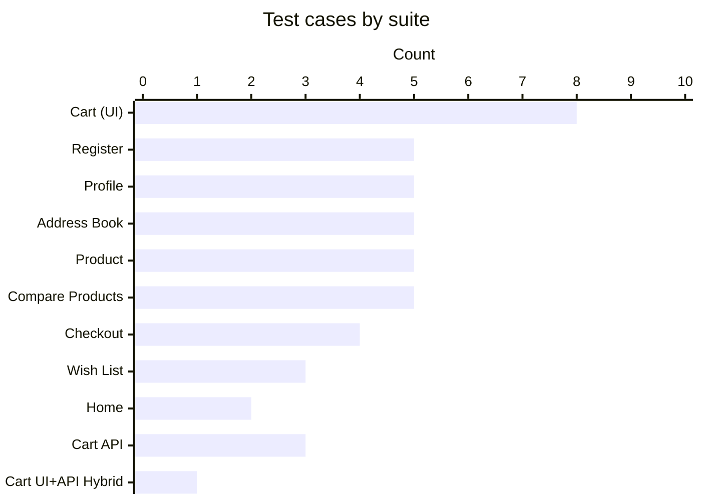
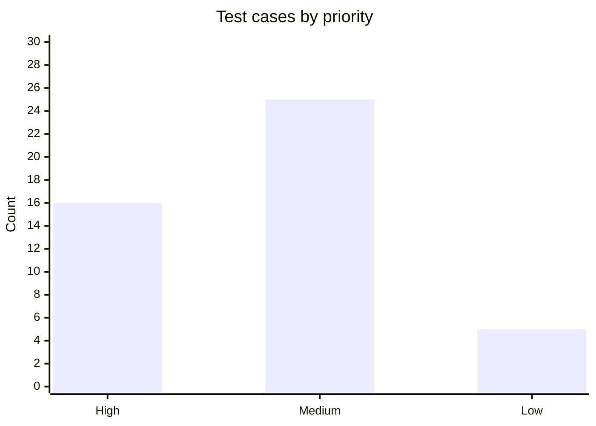
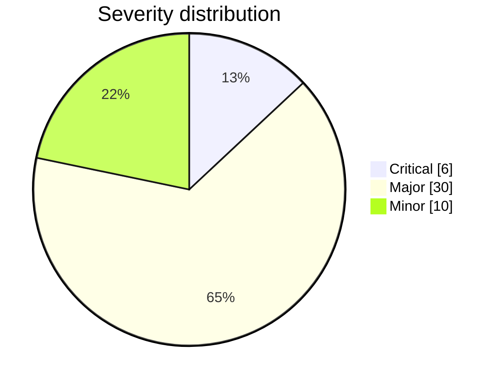
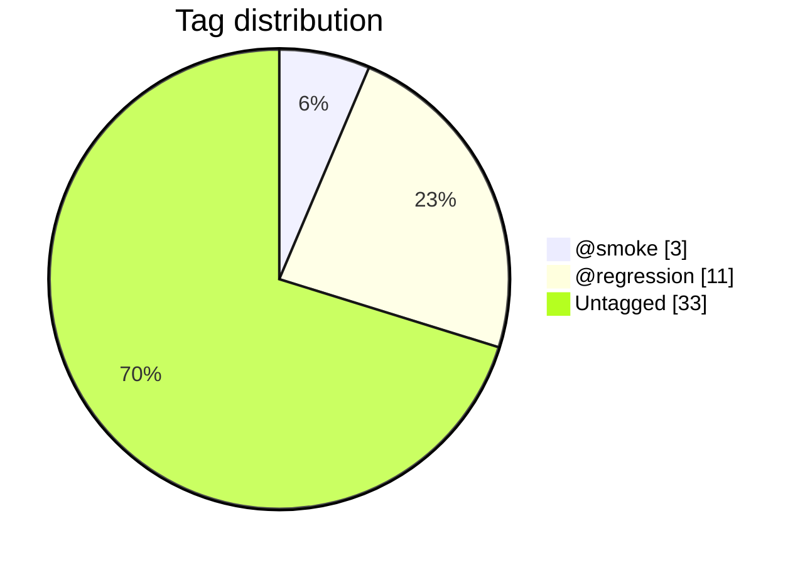
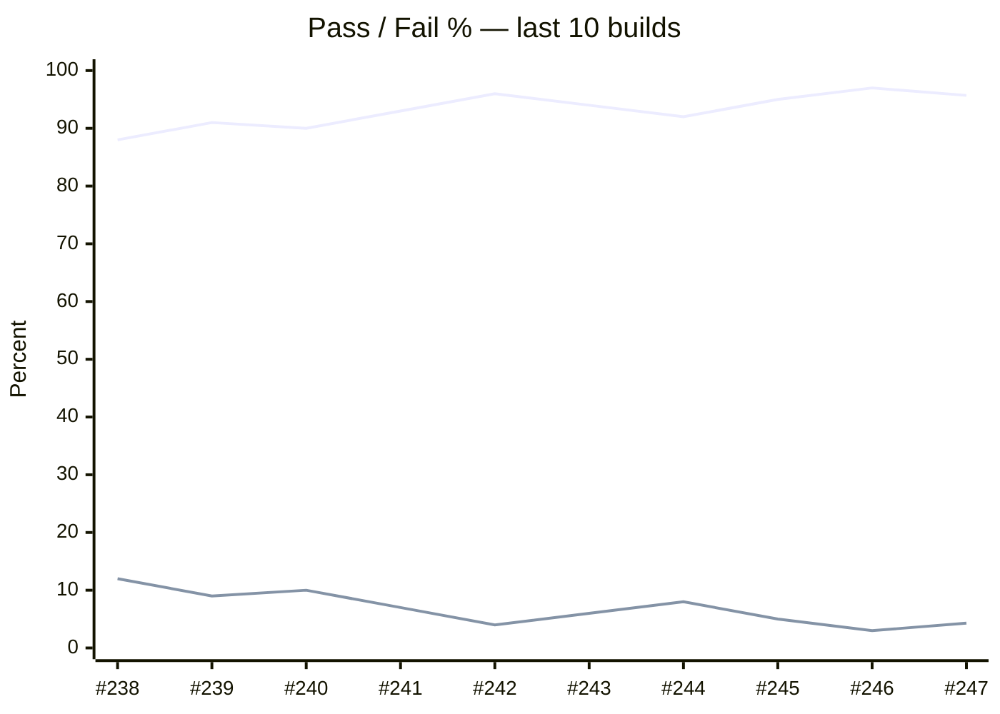
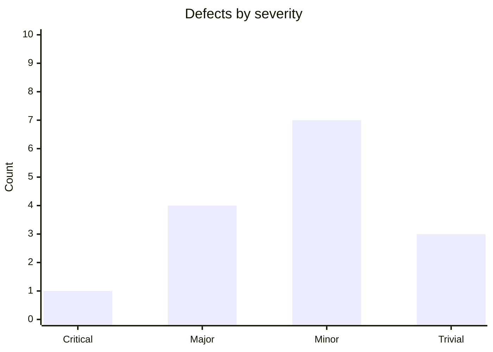

# QA Metrics Dashboard

> **`ai-qa-training`** · Playwright + TypeScript · last refreshed **2026-05-09 14:02 ICT** (build **#247**)
>
> Markdown export of the interactive Cursor Canvas at
> `~/.cursor/projects/Users-khanhdo-Documents-KD-ai-qa-training/canvases/qa-metrics-dashboard.canvas.tsx`.
> Charts are rendered with [Mermaid](https://mermaid.js.org), which GitHub Wiki natively supports.

---

## Hero

| Test Cases | Active Suites | Automation Coverage | Latest Pass Rate (#247) |
|:----------:|:-------------:|:-------------------:|:-----------------------:|
| **46**     | **11**        | **100%**            | **95.7%**               |

---

## 1 · Test Case Coverage

> 46 manual test cases · 1 : 1 mapped to 12 Playwright spec files.

### Test cases by suite

### By priority

### By severity

### By tag

### By type

| Type   | Cases | Share |
|--------|------:|------:|
| UI     | 42    | 91%   |
| API    | 3     | 7%    |
| Hybrid | 1     | 2%    |

> [!WARNING]
> **Tag-coverage gap** — 33 of 46 cases (72%) are `Untagged`. Define a tagging policy (`@smoke`, `@regression`, `@critical-path`) so the CI matrix can shard and prioritise correctly.

---

## 2 · Test Execution

> Latest CI run · 7.4 min wall time · target ≥ 95% pass rate · *Source: Playwright reporter*

### Latest run summary

| Total | Passed | Failed | Skipped | Flaky |
|:-----:|:------:|:------:|:-------:|:-----:|
| 46    | 44     | 1      | 1       | 1     |

### Pass-rate trend (last 10 builds)

*Top line = Pass %, bottom line = Fail %.*

### Latest run — passed by suite

| Suite              | Type   | Tests | Passed | Status        |
|--------------------|--------|------:|-------:|---------------|
| Cart (UI)          | UI     | 8     | 8      | All passing   |
| Register           | UI     | 5     | 5      | All passing   |
| Profile            | UI     | 5     | 5      | All passing   |
| Address Book       | UI     | 5     | 5      | All passing   |
| Product            | UI     | 5     | 5      | All passing   |
| Compare Products   | UI     | 5     | 5      | All passing   |
| Checkout           | UI     | 4     | 3      | 1 failing     |
| Wish List          | UI     | 3     | 3      | All passing   |
| Home               | UI     | 2     | 2      | All passing   |
| Cart API           | API    | 3     | 3      | All passing   |
| Cart UI+API Hybrid | Hybrid | 1     | 1      | All passing   |

### Recent failures

| TC ID            | Title                              | Suite     | State | Root cause                       |
|------------------|------------------------------------|-----------|-------|----------------------------------|
| TC-CART-API-02   | Update product quantity in cart    | Cart API  | Fixed | Edit endpoint payload shape      |
| TC-CHECKOUT-02   | Toggle "same address" recovery     | Checkout  | Flaky | Shipping section race            |

---

## 3 · Defects

> Connect Jira / GitHub Issues / Linear via MCP — values shown are **illustrative**.

### Status counts

| Open | In Progress | Resolved | Closed |
|:----:|:-----------:|:--------:|:------:|
| 11   | 5           | 6        | 28     |

### By severity

### By module (Open vs Closed)

| Module     | Open | Closed |
|------------|-----:|-------:|
| Cart       | 3    | 8      |
| Checkout   | 4    | 5      |
| Register   | 1    | 6      |
| Profile    | 2    | 3      |
| Wishlist   | 1    | 2      |
| Compare    | 0    | 4      |

```mermaid
xychart-beta
    title "Defects by module — Open vs Closed"
    x-axis ["Cart", "Checkout", "Register", "Profile", "Wishlist", "Compare"]
    y-axis "Count" 0 --> 10
    bar [3, 4, 1, 2, 1, 0]
    bar [8, 5, 6, 3, 2, 4]
```

*First bar series = Open, second = Closed.*

### Issues

> The live row list is rendered into `artifacts/qa-metrics-dashboard.live.html` and `artifacts/qa-metrics-dashboard.pdf` after `npm run export:dashboard`. The table below is an illustrative snapshot — re-export to refresh.

| #     | Title                                              | Status      | Severity | Module     | Assignee | Updated     |
|------:|----------------------------------------------------|:-----------:|:--------:|:----------:|:--------:|:-----------:|
| #101  | Add to cart shows wrong total when qty > 9         | Open        | Major    | `cart`     | alice    | 2026-05-08  |
| #97   | Address book country dropdown empty after save     | In Progress | Major    | `profile`  | bob      | 2026-05-07  |
| #92   | Wishlist item duplicated on retry click            | Open        | Minor    | `wishlist` | —        | 2026-05-06  |
| #88   | Checkout shipping label flickers on slow nets      | Resolved    | Minor    | `checkout` | alice    | 2026-05-04  |
| #74   | Compare empty-state copy typo                      | Closed      | Trivial  | `compare`  | —        | 2026-04-30  |

> Sort order in the live HTML: `Open → In Progress → Resolved → Closed`, then most-recently-updated first within each bucket. Source: `reports/defects.json` produced by `scripts/fetch-defects.ts`.

---

## 4 · Requirements Traceability

> Requirements ↔ Manual TC ↔ Spec file · **88% covered** (Covered + ½ × Partial).

### Coverage summary

| Total Requirements | Fully Covered | Partial | Coverage Gap |
|:------------------:|:-------------:|:-------:|:------------:|
| 14                 | 11            | 2       | 0 (1 Won't Fix) |

### Traceability matrix

| Req ID       | Requirement                       | Test Cases             | Spec                              | TCs | Status   |
|--------------|-----------------------------------|------------------------|-----------------------------------|----:|----------|
| REQ-AUTH-01  | User registration                 | TC-REGISTER-01..05     | `test-register.spec.ts`           | 5   | Covered  |
| REQ-AUTH-02  | Password change w/ re-login       | TC-PROFILE-05          | `test-profile.spec.ts`            | 1   | Covered  |
| REQ-ACCT-01  | Account dashboard + edit          | TC-PROFILE-01..04      | `test-profile.spec.ts`            | 4   | Covered  |
| REQ-ADDR-01  | Address book CRUD                 | TC-ADDRESS-01..05      | `test-address-book.spec.ts`       | 5   | Covered  |
| REQ-HOME-01  | Homepage entry points             | TC-HOME-01..02         | `test-home.spec.ts`               | 2   | Partial  |
| REQ-PROD-01  | Product detail interactions       | TC-PRODUCT-01..05      | `test-product.spec.ts`            | 5   | Covered  |
| REQ-CMP-01   | Compare products                  | TC-COMPARE-01..05      | `test-compare-products.spec.ts`   | 5   | Covered  |
| REQ-CART-01  | Cart CRUD (UI)                    | TC-CART-01..08         | `test-cart.spec.ts`               | 8   | Covered  |
| REQ-CART-02  | Cart API contracts                | TC-CART-API-01..03     | `api/test-cart.spec.ts`           | 3   | Covered  |
| REQ-CART-03  | UI ↔ API consistency              | TC-CART-HYBRID-01      | `api/test-cart-ui-api.spec.ts`    | 1   | Partial  |
| REQ-CHK-01   | Checkout happy + edge             | TC-CHECKOUT-01..04     | `test-checkout.spec.ts`           | 4   | Covered  |
| REQ-WL-01    | Wishlist flows                    | TC-WISHLIST-01..03     | `test-wish-list.spec.ts`          | 3   | Covered  |
| REQ-SEC-01   | Session security & authorization  | SEC-01..05             | `api/test-security.spec.ts`       | 5   | Covered  |
| REQ-PAY-01   | Payment gateway integration       | See note               | —                                 | 0   | Won't Fix |

> [!NOTE]
> **Coverage decisions**
>
> - **REQ-PAY-01** — Marked *Won't Fix (out of SUT scope)*. The OpenCart demo exposes only Cash on Delivery; there is no real Stripe / PayPal / 3DS surface to exercise. The existing checkout suite (`TC-CHECKOUT-01..04`) covers the COD order-placement path, which is the only payment integration this SUT supports. Revisit if the SUT gains a real gateway.
> - **REQ-SEC-01** — Reframed from "CSRF / auth-header validation" (which did not match OpenCart's session-cookie auth model) to **Session security & authorization**. Covered by `tests/api/test-security.spec.ts` (SEC-01 cookie hardening, SEC-02 session rotation, SEC-03 HTTPS enforcement, SEC-04 anonymous-access boundary, SEC-05 brute-force throttling — opt-in via `RUN_BRUTE_FORCE`). Failures on the public demo are real defects to log with `severity:major, module:auth`.

---

## Data sources

- **Test cases & coverage** — parsed from `documents/manual-testcases/` and `tests/`.
- **Execution metrics** — should come from `reports/custom-reporter.ts` JSON output. Replace the latest-run / trend numbers above with values from your CI artifact.
- **Defects** — connect Jira / GitHub Issues via MCP and replace the illustrative values in section 3.

> The dashboard is static. Recommended refresh cadence: regenerate after each CI run or nightly.
